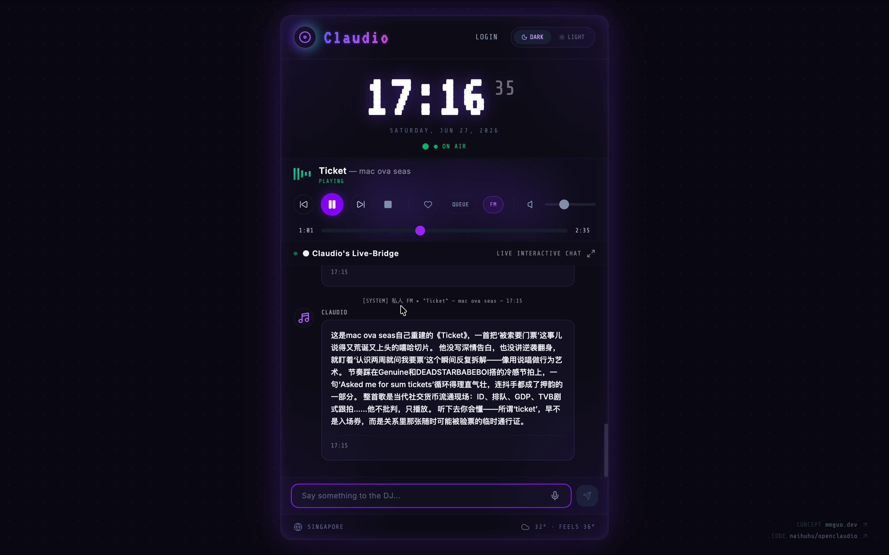
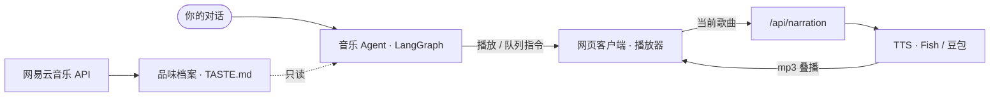

<div align="center">



# Open Claudio

**会聊音乐、也能动手放歌的私人电台 Agent**

[](LICENSE)


[](https://github.com/naihuhu/open-claudio)

[功能](#功能)&nbsp;·&nbsp;[快速开始](#快速开始)&nbsp;·&nbsp;[配置](#配置)&nbsp;·&nbsp;[架构](#架构)&nbsp;·&nbsp;[技术栈](#技术栈)

</div>

Claudio 把一个懂音乐的乐迷和一个能动手的选曲师合进了同一个 Agent。它接管网易云的曲库和你本地的网页播放器：你用一句话说出想听什么，它负责搜歌、建单、调整队列，也能回答关于歌曲、歌手和曲风的问题。打开串词开关，它还会在每首歌播放时即兴生成一段口播，结合当前曲目、你所在城市的天气和时间，用深夜电台 DJ 的口吻念出来。

> [!IMPORTANT]
> 创意与原型来自 [mmguo.dev](https://mmguo.dev)，本仓库是对其的一个开源复刻实现。

<div align="center">

<!-- 强烈建议放一段演示 GIF：放歌 + DJ 串词的实际效果最能体现项目特色 -->
<!-- 例如： -->

</div>

## 功能

**对话选曲与建单**

用自然语言找歌、攒歌单、往队列里加歌或删歌，而不必在固定列表里翻找。歌曲背景、歌词含义、专辑、曲风都能直接问；遇到拿不准的事实，它会明说不确定，而不是编造。

**真正驱动播放器**

播放、暂停、上一首、下一首、跳转、音量、队列增删，全部由 Agent 通过工具直接控制你的网页客户端，而不止于给出建议。

**私人 FM**

启动即进入一条不间断的单曲流，听完一首自动接下一首，无需预先攒好歌单。

**电台 DJ 串词**

对任意正在播放的歌曲，它都能在播放时即兴生成一段口播，叠加在音乐之上（客户端会做 ducking 压低背景）。串词带着城市天气与时间感，语气是贴近麦克风的深夜电台主持，可随时手动开关。

**品味档案**

读取你网易云的听歌频率、喜欢的歌与自建歌单，去重聚合成一份以「艺人 + 权重」为核心的品味画像，供选曲时参考。

## 快速开始

运行前请准备好 Node.js 20+、一个网易云音乐账号（登录后读取曲库与品味数据）、一个 OpenAI 兼容的 LLM 接口，以及一个 TTS key（[Fish Audio](https://fish.audio) 或[豆包语音](https://www.volcengine.com/product/voice-tech) 二选一，用于合成 DJ 串词）。

克隆仓库并准备配置文件：

```bash
git clone https://github.com/naihuhu/open-claudio
cd open-claudio
cp .env.example .env      # 按下方「配置」说明填写
```

**使用 Node 启动**

```bash
npm install
npm run build
npm run start
```

**或使用 Docker 启动**

```bash
docker compose up -d --build
```

启动后访问：http://localhost:3000 

## 配置

配置的优先级是 `config.json` > `.env` > 内置默认值。`config.json` 是权威来源，在那里设过的值永远胜出；`.env` 只填补 `config.json` 中留空的项，并在首次运行时生成一份 `config.json`。界面主题、串词开关、默认 FM 开关等偏好都存放在 `config.json` 里，也可以点击左上角的 Claudio logo 打开设置界面修改。

下面是关键环境变量，完整说明见 [.env.example](.env.example)：

| 变量 | 说明 |
| --- | --- |
| `LLM_API_ADDRESS` / `LLM_API_KEY` / `LLM_MODEL_NAME` | OpenAI 兼容的 LLM 接口 |
| `CLAUDIO_MAX_INPUT_TOKENS` | 每轮喂给模型的历史预算（默认 8000，大上下文模型可调高） |
| `TTS_PROVIDER` | `fish` 或 `doubao`；留空时自动择优（两者都配则 Fish 优先） |
| `DOUBAO_TTS_*` | 豆包语音合成的 key、音色等 |
| `FISH_*` | Fish Audio 的 key、音色 id、语速、代理等（电台质感主要靠 `FISH_TTS_REFERENCE_ID` 调节） |
| `FM_DEFAULT` | 启动是否直接进入私人 FM（默认开，需登录网易云） |
| `CLAUDIO_DIR` | 持久化数据目录（默认 `~/.claudio`） |
| `PORT` / `HOST` | 服务监听地址（默认 `0.0.0.0:3000`） |
| `LOG_LEVEL` | `error` / `warn` / `info` / `debug`，可运行时修改 |

## 架构

Claudio 是一个本地优先的应用：一个 Express 进程对外提供 API 并托管前端，所有音乐数据、品味档案和对话历史都落在本机的 `CLAUDIO_DIR` 目录下。



**品味档案**

从网易云抓取听歌记录、喜欢列表和自建歌单，去重后聚合成「艺人 + 权重」，原子写入 `TASTE.md`，对外只读。

**音乐 Agent**

基于 LangGraph `createAgent` 的单层 ReAct Agent。音乐工具（搜索、建单、查询）与播放器工具（队列、播放控制）平铺在同一层，带副作用的工具把指令搭车在事件流里交给客户端执行。这里刻意使用裸 LangGraph 而非 deepagents，是为了避免后者「先规划再执行」的内置倾向，诱导较弱的模型反复搜索却迟迟不提交。

**串词与 TTS**

独立于 Agent，由 `/api/narration` 在每首歌播放时按当前曲目生成一段 mp3，交给前端叠播。

## 技术栈

| 层 | 选型 |
| --- | --- |
| 后端 | Node.js · TypeScript · Express |
| Agent | LangChain · LangGraph，对接任意 OpenAI 兼容的 LLM |
| 前端 | React 19 · Vite · Tailwind CSS |
| 音乐 | 网易云音乐 API（`@neteasecloudmusicapienhanced/api`，进程内调用，无 HTTP 转发） |
| 语音 | Fish Audio · 豆包语音（双 TTS，两者都配则 Fish 优先） |
| 持久化 | 本地文件 · SQLite（对话 checkpoint） |

## 贡献与反馈

欢迎通过 [Issue](https://github.com/naihuhu/open-claudio/issues) 反馈问题或提出建议，也欢迎直接提交 PR。

扫码加入微信交流群：

<div align="center">

</div>

## Star History

[](https://star-history.com/#naihuhu/open-claudio&Date)

## 关于本项目

本项目源于个人对 Agent 技术的探索与学习，用于记录实践、分享思路，没有任何商业意图。它与网易云音乐没有官方关联，仅通过社区维护的第三方接口读取使用者本人账号下的数据；不存储、也不分发任何音乐内容，相关版权均归原权利方所有。欢迎用于学习与二次创作，若作他用，请自行遵循相关服务的条款，并自负其责。

## 许可

基于 [MIT 许可证](LICENSE) 开放，可自由使用、修改与分发，按「现状」提供，不附带任何明示或默示的担保。